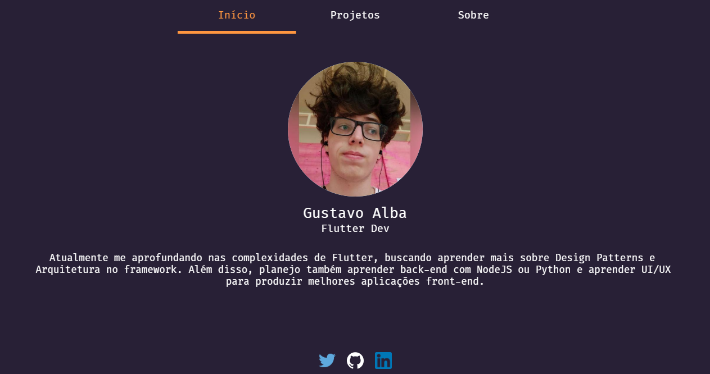
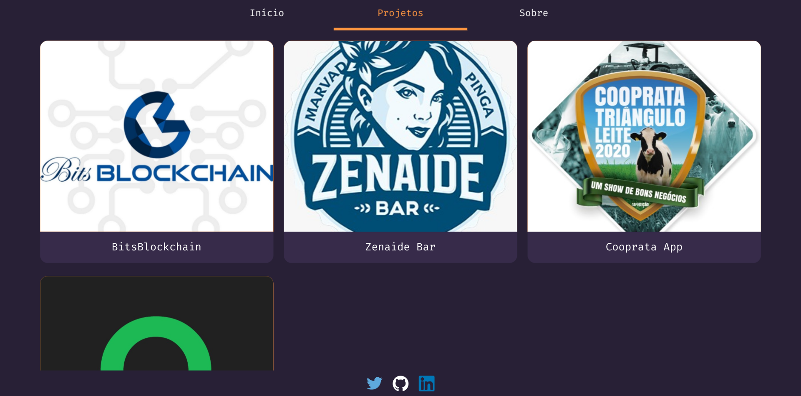
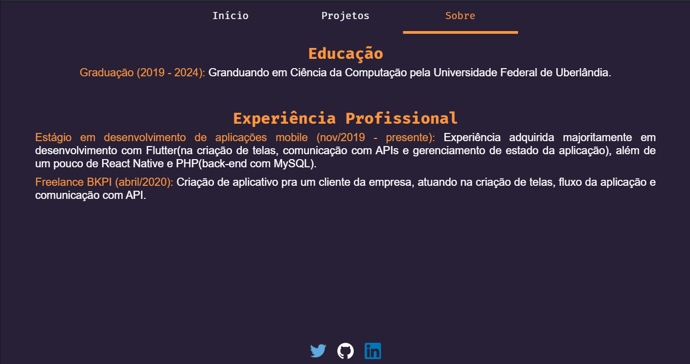

# [alba-22.github.io](https://alba-22.github.io)

Personal Portfolio/Site made with Flutter Web
All code in this repository was generated by Flutter itself when project was builded.
Repository with source code made in Dart: [Alba-22/portfolio-flutter](https://github.com/Alba-22/portfolio-flutter)

#### Some Images

#### Used Plugins
- [AutoSizeText](https://pub.dev/packages/auto_size_text): helps with some responsiveness and layout by automatically resizing text
- [URL Launcher](https://pub.dev/packages/url_launcher): used to redirect user to other websites. In this case, to redirect user to Twitter, Github, LinkedIn or Google Play Store.